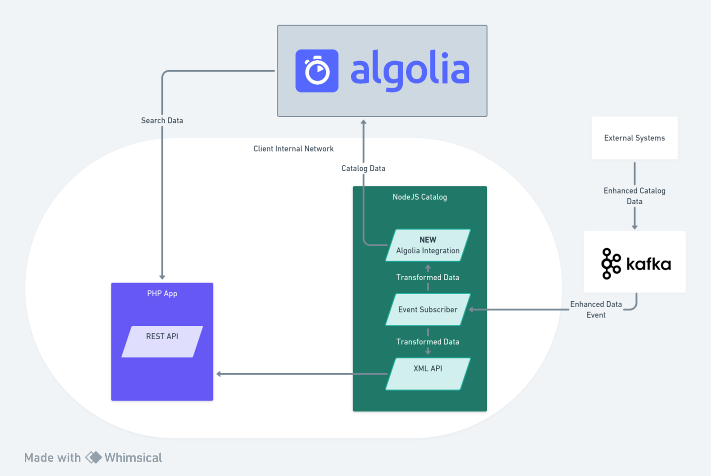

# Algolia Take Home Project

This project is a simple implementation of Algolia's search API utilizing Typescript to ingest data from a fictional catalog service, and the instantsearch.js package to create an example UI.

## CodeSandbox
A CodeSandbox environment has been created for this project and can be accessed [here](https://codesandbox.io/p/github/prestonchoate/algolia-take-home/main?file=%1Fsrc%2Findex.ts).

## Architecture

